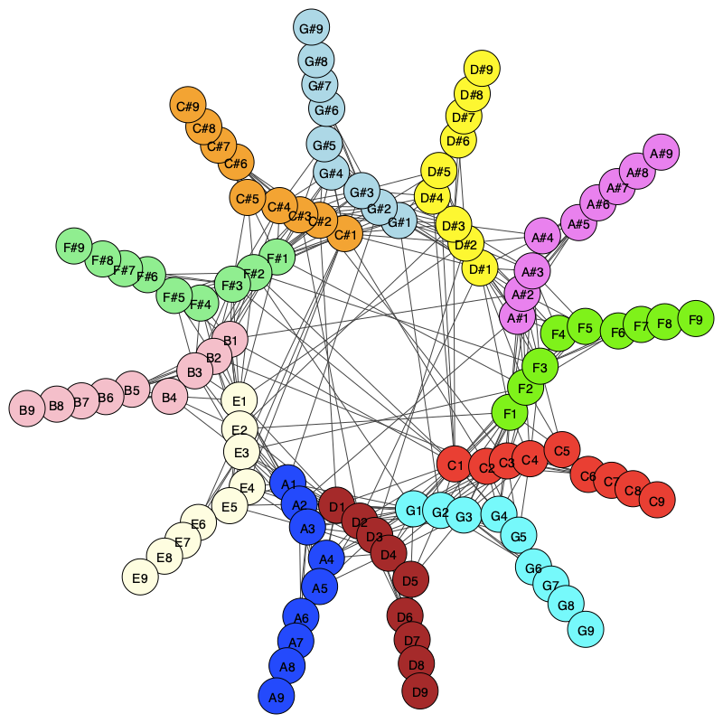

# Syntonets: Toward A Harmony-Inspired General Model of Complex Networks
Here, we make available the codes used to create the Syntonets. These networks are based on consonance and dissonance between notes. For that, we employ a method based on Helmholtz's consonance approach. 

More information regarding the employed methodology is available on the [syntonet's](https://arxiv.org/abs/1910.11047) paper.

The codes are implemented in Python 3.8.5 in "syntonets.py." The primary function that creates the network is named "create_network" In order to visualize the created network, the function "visualize" can be employed. For both cases, the instructions of use are described in the code. We also provide an example of use ("test.ipynb").

The following figure represents an example of Syntonet created considering equal temperament.

## Packages
All the codes were developed and executed with the environment described in "packages.txt." 

## Citation Request
If you use this code in a scientific work, please cite us as: 
da F. Costa, Luciano, and F. de Arruda, Henrique. "Syntonets: Toward A Harmony-Inspired General Model of Complex Networks." F. Costa, Luciano, and F. de Arruda, Henrique. "Syntonets: Toward A Harmony-Inspired General Model of Complex Networks." Eur. Phys. J. B, 93 12 (2020) 224.

## Acknowledgements
Luciano da F. Costa thanks CNPq (grant no. 307085/2018-0) and NAP-PRP-USP for sponsorship. Henrique F. de Arruda acknowledges FAPESP for sponsorship (grant no. 2018/10489-0 and no. 2019/16223-5). This work has been supported also by FAPESP grants 2015/22308-2.
